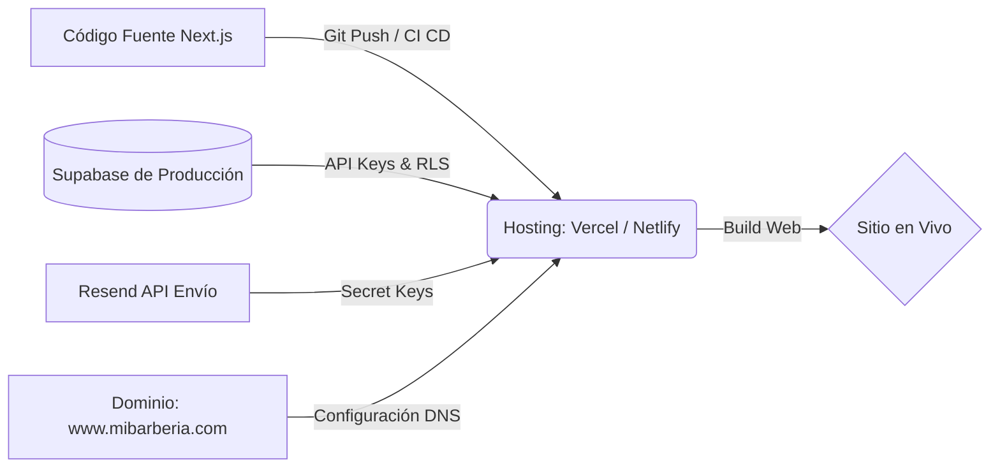
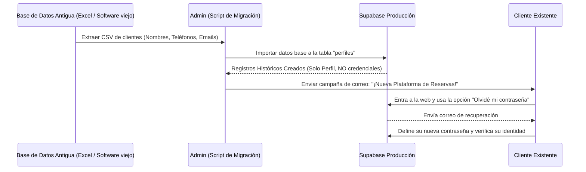

# 🚀 Plan de Despliegue Real y Puesta en Producción

Este documento está dirigido al dueño del negocio y al equipo de infraestructura técnica. Detalla el proceso riguroso de transición de la aplicación **Barber Pro Web** desde su entorno de desarrollo local y pruebas (Sandbox) hacia el entorno en vivo (Producción).

---

## 1. Contexto: Etapa de Desarrollo Actual

Actualmente, el proyecto se encuentra estructurado en su fase final de desarrollo (Next.js 16).
*   **Datos en Base de Datos (Supabase):** Todos los clientes, servicios y citas creadas hasta hoy son **ficticios o de prueba**. Serán vaciados (reset) antes de abrir al público.
*   **Correos Electrónicos (Resend):** La plataforma de envío de correos puede estar limitada solo a correos autorizados por el equipo de desarrollo.
*   **Aviso Importante:** Esta fase sirve únicamente para validar el diseño en Tailwind CSS, el enrutamiento (App Router) y la experiencia de usuario. **No usar este ambiente para agendar compromisos reales y definitivos.**

---

## 2. Preparación de la Infraestructura de Producción

Para que la aplicación soporte un tráfico real de clientes diarios sin interrupciones, se debe configurar una infraestructura robusta de "Producción".

### 2.1 Requisitos Críticos de Infraestructura
1.  **Nuevo Proyecto de Supabase (Prod):** Instanciar un servidor en Supabase de producción, ejecutar las migraciones SQL de todas las tablas y, sobre todo, activar las **Políticas de Seguridad (RLS)** para asegurar que un cliente no pueda ver la información ni reservas de otro.
2.  **Verificación de Correos (Resend):** Añadir y verificar el dominio oficial de la barbería en el panel de Resend para habilitar el envío masivo y asegurar que los correos automáticos no caigan en bandejas de SPAM.
3.  **Variables de Entorno (`.env`):** El equipo técnico actualizará en el servidor de despliegue las variables `NEXT_PUBLIC_SUPABASE_URL`, `NEXT_PUBLIC_SUPABASE_ANON_KEY`, y otras credenciales secretas necesarias para conectar el frontend con las bases de datos de producción.

---

## 3. Migración de Base de Datos Antigua y Clientes Previos

La barbería cuenta con un negocio andando y clientes previos. El objetivo es que estos no se pierdan al implementar el sistema nuevo.

### 3.1 Proceso de Importación Segura

### 3.2 Manejo de Credenciales y Privacidad
Por los más altos estándares de ciberseguridad, **es imposible migrar contraseñas** de plataformas anteriores a Supabase.
*   **Para los Clientes:** Existirán en la base de datos para no perder su historial o puntos de fidelidad (si aplica), pero deberán generar una contraseña nueva solicitando el correo de recuperación en su primer intento de acceso.
*   **Para el Personal (Barberos, Admins):** Está estrictamente prohibido compartir contraseñas genéricas como "barbero123". Cada barbero debe generar su propia cuenta vinculada a su propio correo electrónico personal o corporativo para garantizar la auditoría de quién realiza cada acción en el `/dashboard`.

---

## 4. Estrategia Escalonada de Lanzamiento ("Go-Live")

No se recomienda un cambio drástico ("Big Bang"). El sistema se desplegará en 3 fases:

### Fase 1: Soft Launch (Uso Interno) - Días 1 al 3
*   **Aprovisionamiento:** El administrador maestro configura los horarios de apertura globales y los catálogos de servicios con precios reales.
*   **Simulación Diaria:** Los barberos ya tienen su acceso activo. Durante estos días, el local seguirá tomando reservas por vía telefónica/WhatsApp, pero **obligatoriamente registrará estas citas de forma manual en el nuevo panel de administrador/barbero**. Esto probará los algoritmos de solapamiento de calendarios con presión real.

### Fase 2: Clientes Beta (Prueba Controlada) - Días 4 al 7
*   El local selecciona a sus 20-30 clientes más recurrentes y de confianza.
*   Se les envía el enlace web de forma privada, solicitando que agenden su siguiente cita exclusivamente por Barber Pro Web.
*   Se valida la UX: ¿Les llegó el correo rápido? ¿Pudieron cancelar la cita? ¿El barbero la vio correctamente en su celular?

### Fase 3: Lanzamiento Oficial y Público - Día 8 en adelante
*   Se vincula el dominio de la barbería oficialmente al despliegue en Vercel.
*   **Campaña de Marketing:** Publicación en redes sociales (Instagram, TikTok) anunciando que ahora la agenda es 100% en línea 24/7.
*   **Físico:** Integrar códigos QR impresos en los espejos de los cortes y la sala de espera que dirijan al móvil del usuario a la ruta de registro `/(auth)`.
*   A partir de este día, se descontinúa cualquier agenda de papel o excel viejo.
