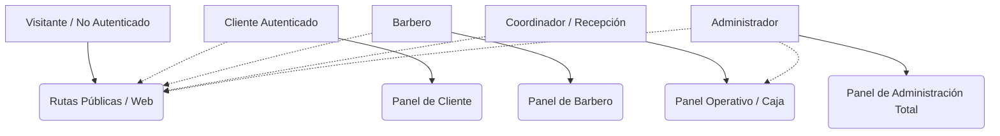
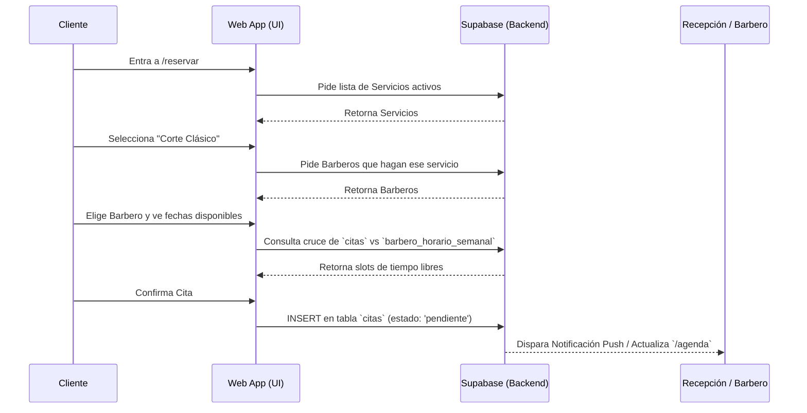
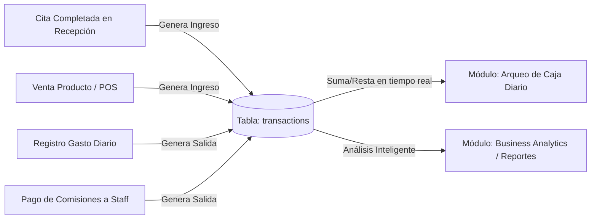

# 💈 Documentación Técnica y Funcional del Sistema Barber Pro Web

Este documento proporciona una visión general completa de la estructura del sistema, los roles de usuario, las páginas (rutas) y cómo interactúan entre sí. Está diseñado para facilitar la enseñanza, el mantenimiento y la escalabilidad del proyecto, ayudando a que cualquier nuevo desarrollador o administrador entienda la arquitectura de un vistazo.

---

## 1. Roles de Usuario y Accesos

El sistema maneja **4 roles principales**, cada uno con un nivel de acceso jerárquico. La seguridad de los datos está respaldada por RLS (Row Level Security) en Supabase.

| Rol | Descripción | Permisos Clave |
|---|---|---|
| **Administrador** | Dueño o gerente general. Acceso total e irrestricto al sistema. | Reportes, configuraciones globales, RRHH, finanzas profundas, inventario total. |
| **Coordinador** | Recepcionista o cajero. Maneja el flujo de caja diario y la sucursal física. | Arqueos de caja, cobro de citas, registro de egresos, ventas de mostrador. |
| **Barbero** | Miembro del staff (peluquero). Solo ve su propia información. | Su agenda personal, sus comisiones ganadas, registro de asistencia. |
| **Cliente** | Usuario final. Consume los servicios del negocio. | Agendar citas, historial personal, acumulación de puntos de lealtad. |

---

## 2. Mapa del Sitio y Descripción de Páginas

El proyecto utiliza el App Router de Next.js (`src/app/`). A continuación, el detalle de qué hace cada carpeta/ruta:

### 🌐 Rutas Públicas (Front-end Comercial)
Páginas accesibles para cualquier persona en internet. Sirven como la "cara" del negocio.
*   **`/` (Home):** Landing page de presentación de la barbería.
*   **`/reservar`:** El motor principal. Un "Wizard" paso a paso para agendar una cita (Servicio -> Barbero -> Fecha -> Confirmación).
*   **`/calendario`:** Vista pública rápida de disponibilidad de los barberos sin necesidad de iniciar el Wizard.
*   **`/galeria`:** Muestra de cortes (portafolio).
*   **`/tienda`:** Catálogo estilo e-commerce para vender productos (ceras, minoxidil).
*   **`/login` y `/register`:** Autenticación de usuarios.

### 👥 Rutas de Uso Diario y Compartidas (`/dashboard`)
*   **`/recepcion`:** Pantalla rápida para el mostrador. Muestra quién está esperando, quién está en silla y citas próximas.
*   **`/agenda`:** El corazón operativo. Un calendario interactivo (FullCalendar). El admin/coordinador ve a todos los barberos; el barbero solo ve sus citas.
*   **`/notificaciones`:** Centro de alertas del sistema.

### 👑 Panel de Administración (`/admin/*`)
El núcleo de control del dueño.
*   **Analíticas:**
    *   `/admin/reportes`: Dashboard avanzado de Business Analytics (KPIs, LTV, Tendencias MoM, Finanzas, Gráficos).
*   **Catálogos y Ventas:**
    *   `/admin/servicios`: CRUD de los servicios ofrecidos, sus precios y duración.
    *   `/admin/productos` & `/admin/inventario-fisico`: Control de stock, costos y proveedores.
*   **Gestión de Personal (RRHH):**
    *   `/admin/equipo`: Perfiles de barberos y porcentajes de comisión.
    *   `/admin/horarios` & `/admin/reglas-laborales`: Turnos semanales, vacaciones y bloqueos de agenda.
    *   `/admin/asistencia`: Control de llegadas tarde, ausencias y horas trabajadas.
    *   `/admin/comisiones`: Visión global de lo que se le debe pagar al staff.
*   **Marketing y CRM:**
    *   `/admin/lealtad`: Configuración de metas y niveles (Bronce, Plata, Oro).
    *   `/admin/portafolio`: Aprobación de las fotos subidas por los barberos para la galería.
*   **Sistema:**
    *   `/admin/usuarios`: Gestión de roles en la base de datos.
    *   `/admin/auditoria`: Log de auditoría (quién editó, cobró o borró qué registro).
    *   `/admin/configuracion`: Ajustes globales (horario del local, nombre, políticas).

### 💼 Panel Operativo / ERP (`/coordinador/*`)
Enfocado exclusivamente en las operaciones del día a día y flujo de caja.
*   **Caja y Contabilidad Diaria:**
    *   `/coordinador/arqueo`: Cierre de caja diario. Cuadre de efectivo físico vs sistema.
    *   `/coordinador/ventas`: Registro de ventas directas en mostrador (POS).
    *   `/coordinador/egresos`: Registro de gastos diarios (luz, insumos, limpieza).
    *   `/coordinador/banco` & `/coordinador/caja-chica`: Movimientos de libros contables.
*   **Gestión de Staff Operativa:**
    *   `/coordinador/comisiones`, `/coordinador/bonos`, `/coordinador/sanciones`: Pagos y descuentos operativos directos a los barberos.
*   **Gestión Rápida de Clientes:**
    *   `/coordinador/cumpleanos`: Verificación de clientes cumpleañeros para aplicar promociones.

---

## 3. Diagramas de Flujos Core

Para entender la lógica del negocio, aquí están los dos flujos más importantes del sistema.

### A. Flujo de Reserva de Citas (Frontend -> Backend)
Cómo viaja la información cuando un cliente reserva por la web.

### B. Ecosistema Financiero y ERP (El Flujo del Dinero)
Cómo interactúan las tablas de operaciones con la contabilidad y los reportes. Todas las acciones de dinero convergen en la tabla central de transacciones.

---

## 4. Estructura de Componentes y Buenas Prácticas

1.  **Server vs Client Components:** La mayoría de las páginas en `/admin` o `/coordinador` están marcadas con `'use client'` para permitir interactividad (estados, modales, gráficos). Sin embargo, la lógica de negocio fuerte recae en la base de datos (PostgreSQL).
2.  **Lógica de Negocio centralizada:** Siempre que es posible, funciones como "Calcular comisión" o "Validar choque de horarios" se delegan a funciones o vistas de la base de datos para asegurar consistencia, o se manejan en `/lib/utils` o servicios dedicados.
3.  **UI Components:** Toda la estructura visual depende de componentes atómicos creados en `@/components/ui/` (Botones, Tarjetas, Modales), basados en Radix UI y Tailwind, manteniendo un diseño uniforme (Dark Mode con acentos ámbar).
