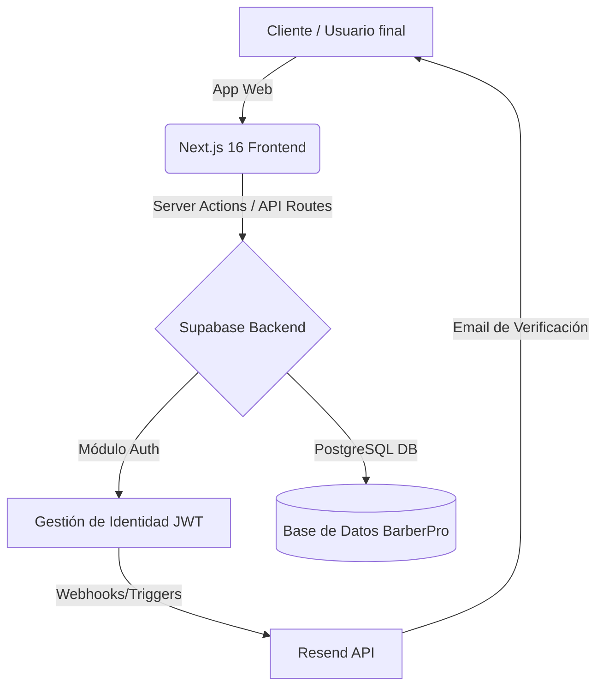
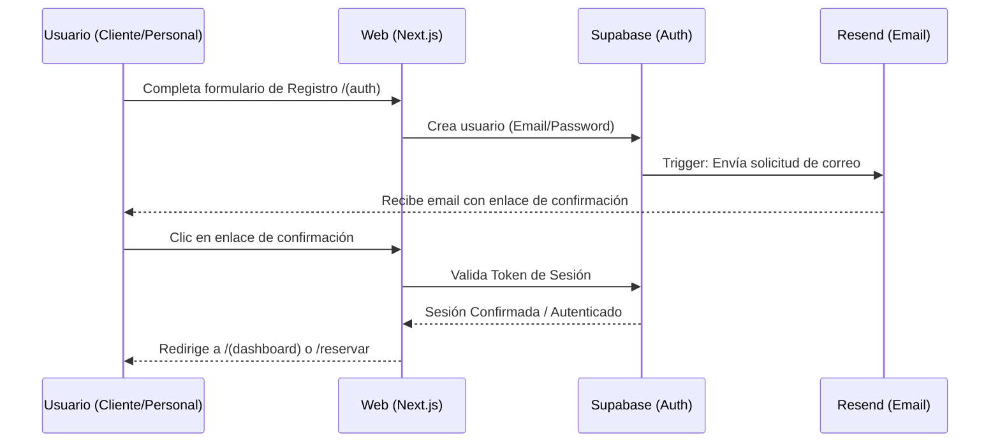
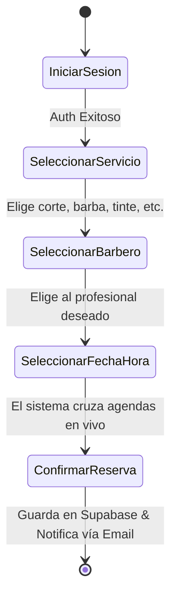

# 📘 Manual Técnico y de Usuario - Barber Pro Web

## 1. Arquitectura del Sistema y Tecnologías

Barber Pro Web es una plataforma moderna desarrollada con tecnologías de última generación para garantizar velocidad, seguridad y escalabilidad, orientada a ofrecer una experiencia "Premium" tanto para los usuarios como para los administradores.

### 1.1 Stack Tecnológico Implementado
El proyecto utiliza herramientas modernas de la industria:
*   **Frontend y Servidor:** **Next.js 16 (App Router)** combinado con **React 19**.
*   **Estilos y Diseño:** **Tailwind CSS v4** para un diseño responsivo, fluido y altamente personalizable, complementado con **Lucide React** para la iconografía.
*   **Backend y Base de Datos:** **Supabase** (PostgreSQL) para almacenamiento relacional, Políticas de Seguridad (Row Level Security - RLS) y Autenticación gestionada vía SSR (Server-Side Rendering).
*   **Correos Transaccionales:** **Resend** para la entrega fiable de correos electrónicos automáticos (confirmaciones de cuenta, recibos de citas).
*   **Métricas y Gráficos:** **Recharts** para generar tableros de análisis visual en el panel de administración.

### 1.2 Diagrama de Arquitectura de Datos

---

## 2. Autenticación y Flujos de Cuentas

La seguridad del sistema está construida sobre **Supabase Auth**. Existen rutas dedicadas bajo la estructura `src/app/(auth)` para el manejo seguro de credenciales, registro y login.

### 2.1 Flujo de Registro e Inicio de Sesión (Supabase)

### 2.2 Creación de Cuentas según el Rol

1.  **Clientes (Acceso Público):** Los clientes se registran por cuenta propia en la web. Supabase los guarda automáticamente y un "trigger" en la base de datos les crea un perfil en la tabla `perfiles` con el rol predeterminado de `cliente`.
2.  **Barberos (Acceso Privado):** No existe un "registro público para barberos" por seguridad. El proceso oficial es:
    *   El barbero se registra como cliente normal en la página web.
    *   Verifica su correo electrónico.
    *   El **Administrador** le asigna el rol de `barbero` desde el **Panel de Control** `/(dashboard)`.
3.  **Administrador (Acceso Total):** Tiene el rol `admin`. La cuenta maestra de administrador se crea configurando la base de datos de forma directa en Supabase durante la primera configuración del despliegue.

---

## 3. Uso del Sistema: Módulos Principales

El proyecto se divide lógicamente en varias rutas (`/reservar`, `/calendario`, `/tienda`, `/galeria`, `/(dashboard)`).

### 3.1 Módulo Público y Reservas (`/reservar`)
Ruta principal donde el cliente navega por el catálogo y procede a agendar su cita de manera autónoma.

**Paso a paso para el cliente:**
1.  Inicia sesión (requisito obligatorio para asociar la cita a su historial).
2.  Elige el servicio (el sistema obtiene descripciones, duraciones y precios directamente de la base de datos).
3.  Elige a un profesional (Barbero).
4.  El calendario verifica la disponibilidad en tiempo real. Utiliza cruces de datos entre los horarios laborales del barbero y sus citas ya ocupadas.
5.  Confirma la cita y recibe notificación.

### 3.2 Módulo de Administración y Barberos (`/(dashboard)`)
Ubicado en la ruta segura `/dashboard`. Dependiendo del rol del usuario validado por Supabase, la interfaz renderiza componentes y permisos distintos:

**Vista para el Administrador:**
*   **Estadísticas y Métricas:** Tablero principal alimentado por *Recharts* que muestra los ingresos del día, servicios más vendidos de la `/tienda`, y desempeño de reservaciones por barbero.
*   **Gestión de Personal:** Interfaz para subir, editar o deshabilitar barberos. El Admin modifica los registros en la tabla `perfiles` para otorgar accesos, subir fotos de perfil, añadir especialidades y determinar las jornadas de trabajo (días y horas libres).
*   **Gestión de Catálogo y Configuración:** Puede crear nuevos servicios en la sección de `/tienda` o cambiar los precios de corte.

**Vista para el Barbero:**
*   **Mi Agenda Personal (`/calendario` interno):** Una vista especializada donde el barbero ve únicamente sus clientes programados del día y de la semana.
*   **Acciones sobre Citas:** Capacidad de marcar una cita como "Completada" (sumando al ingreso diario), o en caso de emergencia, reprogramar o cancelar una cita (lo que dispara una alerta por Resend al cliente).
*   **Bloqueo de Horarios:** El barbero puede bloquear franjas de hora (almuerzos, permisos médicos) para evitar que el algoritmo público en `/reservar` permita a los clientes agendar durante ese tiempo.
